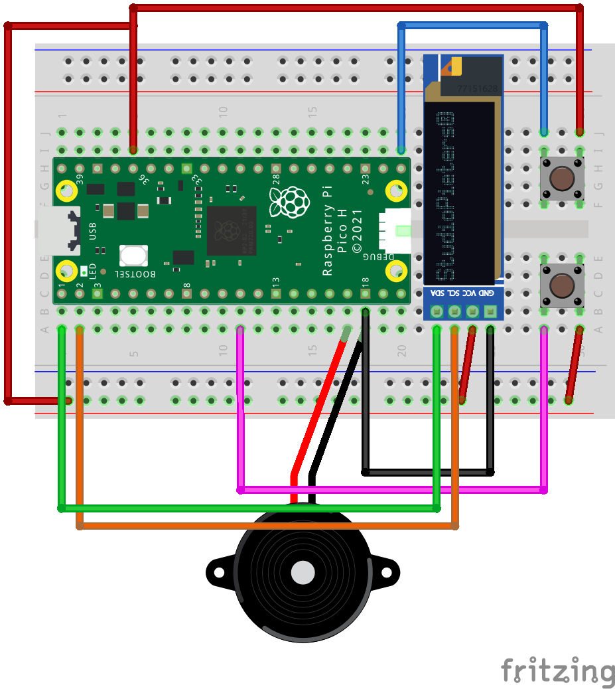

  <h3 align="center">Raspberry Pi Pico Runner Game</h3>

  

    A (relatively) simple raspberry pi pico project that uses some buttons, a display and alot of code to make a 2D side scrolling infinite runner game.
  

<!-- ABOUT THE PROJECT -->
## About The Project

A (relatively) simple raspberry pi pico project that uses some buttons, a display and alot of code to make a 2D side scrolling infinite runner game.
See below for a diagram of the electrical circuit and links to buy all the parts: 

 
<ul>
  <li><a href="https://thepihut.com/products/raspberry-pi-pico?variant=41925332566211">Raspberry Pi Pico H</a></li>
  <li><a href="https://thepihut.com/products/tactile-button-switch-6mm-x-20-pack">Tactile Button Switches 6mm x20 Pack</a></li>
  <li><a href="https://thepihut.com/products/piezo-transducer-12v-buzzer-5200hz">Piezo Transducer 12V Buzzer 5200hz</a></li>
  <li><a href="#">SSD1306 128x32px Display (Link unavailable)</a></li>
  <li><a href="https://thepihut.com/products/premium-male-male-jumper-wires-20-x-6-150mm">Premium Male/Male Jumper Wires 20x6" (150mm)</a></li>
</ul>

(<a href="#readme-top">back to top</a>)

## Usage

To use, wire up the circuit and use a program like Thonny to run the code directly onto teh Pico. (Plenty of tutorials on how to do this on the internet)

(<a href="#readme-top">back to top</a>)

